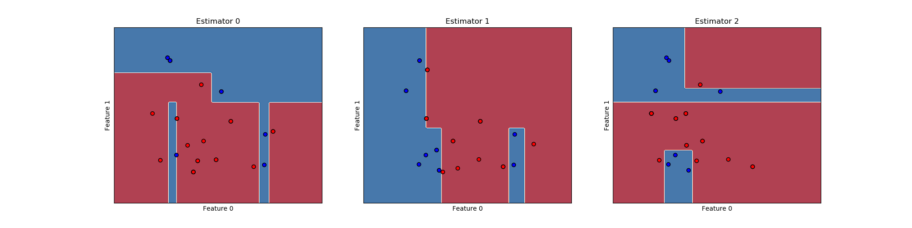
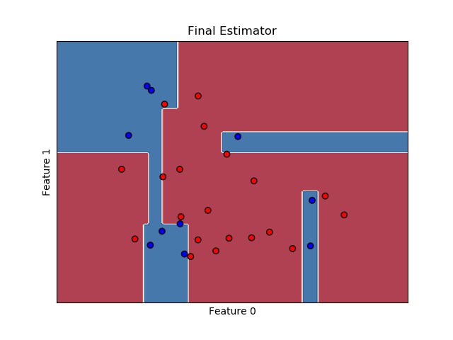
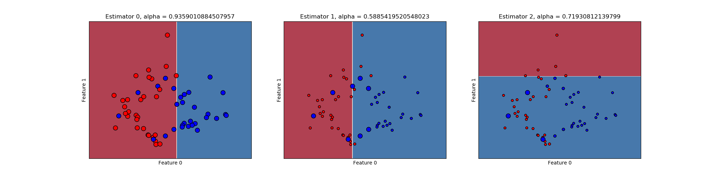
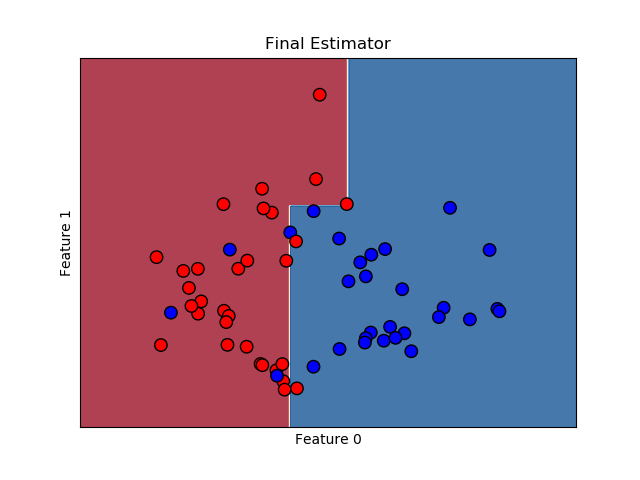
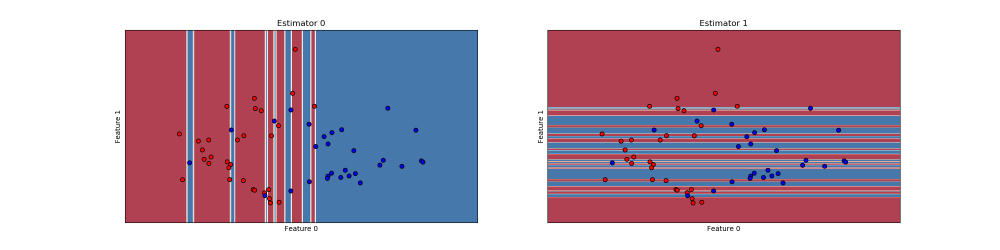
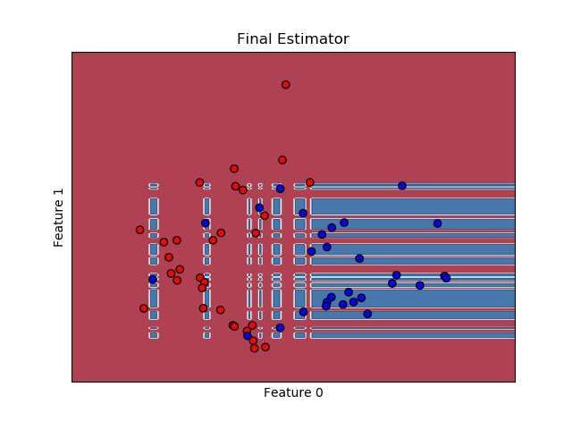

# Ensemble Machine Learning
This repository implements the following algorithms from scratch using SkLearns decision tree as the base estimator:

- Random Forests
- Bootstrap Aggregation
- AdaBoost 


## Examples

### Random Forests

```python

N = 30
P = 5
X = pd.DataFrame(np.random.randn(N, P))
y = pd.Series(np.random.randint(P, size = N), dtype="category")
classifier_RF = RandomForestClassifier(3, criterion = 'information_gain')
classifier_RF.fit(X, y)
y_hat = classifier_RF.predict(X)
```


### AdaBoost

```python

N = 30
P = 2
NUM_OP_CLASSES = 2
n_estimators = 3
X = pd.DataFrame(np.abs(np.random.randn(N, P)))
y = pd.Series(np.random.randint(NUM_OP_CLASSES, size = N), dtype="category")
criteria = 'information_gain'       
tree = DecisionTreeClassifier
classifier_AB = AdaBoostClassifier(base_estimator=tree, n_estimators=n_estimators )
classifier_AB.fit(X, y)
y_hat = classifier_AB.predict(X)
```


### Bootstrap Aggregation (Bagging)

```python
N = 30
P = 2
NUM_OP_CLASSES = 2
n_estimators = 3
X = pd.DataFrame(np.abs(np.random.randn(N, P)))
y = pd.Series(np.random.randint(NUM_OP_CLASSES, size = N), dtype="category")

classifier_B = BaggingClassifier(base_estimator=DecisionTreeClassifier, n_estimators=n_estimators )
classifier_B.fit(X, y)
y_hat = classifier_B.predict(X)
```


## Some Plots


### Bootstrap Aggregation (Bagging)

Individual Estimators:



Final Estimator:




### AdaBoost

Individual Estimators



Final estimator:




### Random Forests


Individual Estimators



Final Estimator




The plots are generated with only 2 classes and 2 features for visualization purposes. Hence, having more than 2 random forests will not help. Moreover, since RF is an ensemble method the classifiers must be diverse implying that the learnt trees should be on different combinations of features. In this case, the maximum number of decorrelated trees that can be learnt is 2, which is what has been chosen.
